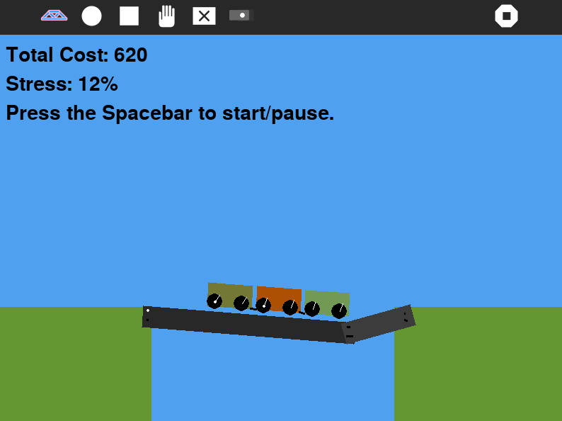

What is this?
=============

Bridge teaches the basics of mechanical engineering through building a bridge across a ravine. It may sound simple but is actually quite engaging and entertaining. Bridge was the result of the Physics Jam H4X team who won the gold prize for their game development.



How to use?
===========

Bridge is not a part of the Sugar desktop, but can be added. Please refer to;

* [How to Get Sugar on sugarlabs.org](https://sugarlabs.org/),
* [How to use Sugar](https://help.sugarlabs.org/)
* [How to use Bridge](http://wiki.laptop.org/go/Bridge)


Bridge depends on Python, [Sugar
Toolkit](https://github.com/sugarlabs/sugar-toolkit-gtk3), Cairo, GTK+ 3, Pango, Box2d and Pygame.

How to develop?
===============

* setup a development environment for Sugar desktop,
* install the dependencies, see below,
* clone this repository,
* edit source files,
* test in Terminal by typing `sugar-activity3`

How to install dependencies for development
===========================================

For development, install the Box2D library.

* Install `swig`,
   - On Ubuntu/Debian, run
    ```sudo apt install swig```
   - On Fedora/RHEL systems, run
    ```sudo dnf install swig```
* Install setuptools and pip,
   - On Ubuntu/Debian, run
   ```sudo apt install python3 python3-setuptools python3-pip python3-all-dev ```
   - On Fedora/RHEL, run
   ```sudo dnf install python3-pip python3-setuptools```
* Clone pybox2d and build, run
```
git clone https://github.com/pybox2d/pybox2d
cd pybox2d
# Make sure you have installed swig
python3 setup.py build
pip3 install . --system

```
